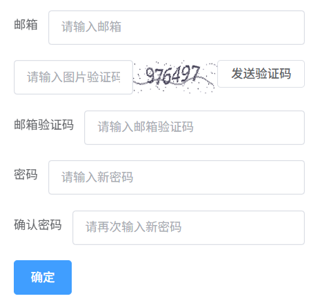

# 找回密码

## 需求分析
用户输入**邮箱**、**邮箱验证码**和**新密码**完成对密码的找回工作，如图所示：  


## 技术方案

### 前端传入参数
```json
{
  "email": "",
  "verification_code": "",
  "new_password": ""
}
```
### 后端存储结构
需要创建结构体存储这三个字段
```go
package request
type ForgotPassword struct {
	Email            string `json:"email" binding:"required,email"`
	VerificationCode string `json:"verification_code" binding:"required,len=6"`
	NewPassword      string `json:"new_password" binding:"required,min=8,max=16"`
}
```
### 密码找回逻辑
用户邮箱验证码验证成功后，只需要将新密码加密后存入到数据库即可。  
查询出邮箱对应的用户信息->将密码加密->重新存入数据库