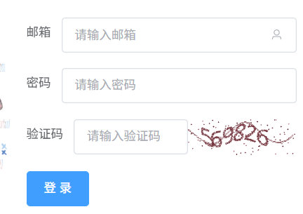

# 用户登录模块
## 需求分析
用户输入**邮箱**、**密码**以及验证码进行登录  
参考样图：  

## 技术方案
### 前端传入的参数
```json
{
  "email": "",
  "password": "",
  "captcha": "",
  "captcha_id": ""
}
```
### 后端存储结构
需要创建请求结构体用以存储这四个字段
```Go
package request
type Login struct {
	Email     string `json:"email" binding:"required,email"`
	Password  string `json:"password" binding:"required,min=8,max=16"`
	Captcha   string `json:"captcha" binding:"required,len=6"`
	CaptchaID string `json:"captcha_id" binding:"required"`
}
```
### 验证码校验方式
用户点击**登录**按钮时，会立即调用captcha接口生成验证码，后端提前将生成的验证码信息存放在全局变量store中，后续只需对请求体中的captcha进行验证即可
### 登录成功性判断
由于数据库存储的是密码的hash值，因此需要比较请求体中的密码的哈希值是否与数据库中存储的一致，如果一致才算登录成功
### 保持会话持久性
用户登录成功后，为了保持连接的持久性，需要为其生成accessToken和refreshToken。  
这两个token的有效期和秘钥在系统配置里设置，生成后后端应当将accessToken及其有效期返回给前端
```Go
package response
type Login struct {
	User                 database.User `json:"user"`
	AccessToken          string        `json:"access_token"`
	AccessTokenExpiresAt int64         `json:"access_token_expires_at"`
}
```