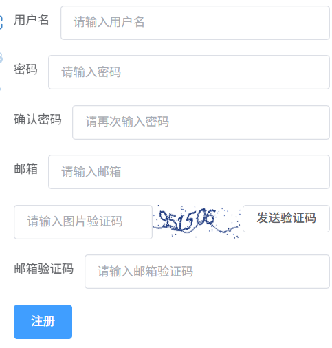

# 用户注册模块
## 需求分析
用户输入**用户名**、**密码**、**邮箱**、**验证码**注册账户，要求注册成功后直接登录，无需重复进入登录界面  
参考样图：

## 技术方案
### 前端传入的参数
```json
{
  "username": "",
  "password": "",
  "email": "",
  "verification_code": ""
}
```
### 后端存储结构
需要创建请求结构体用以存储这四个字段
```Go
package request
type Register struct {
	Username         string `json:"username" binding:"required,max=20"`
	Password         string `json:"password" binding:"required,min=8,max=16"`
	Email            string `json:"email" binding:"required,email"`
	VerificationCode string `json:"verification_code" binding:"required,len=6"`
}
```
对于每个用户，注册成功时都需要更新**用户表**：
```Go
package database
type User struct {
	global.Model
	UUID      uuid.UUID         `json:"uuid" gorm:"type:char(36);unique;not null"`
	Username  string            `json:"username"`
	Password  string            `json:"-"`
	Email     string            `json:"email"`
	OpenID    string            `json:"openid"`
	Avatar    string            `json:"avatar" gorm:"size:255"` // 头像
	Address   string            `json:"address"`
	Signature string            `json:"signature" gorm:"default:'这位用户有点低调，未设置任何签名'"`
	RoleID    apptypes.RoleID   `json:"role_id"`
	Register  apptypes.Register `json:"register"`
	Freeze    bool              `json:"freeze"` //账户是否被冻结
}
```
对于新用户，需要新建uuid、存入username和password（加密）、设置用户角色以及注册方式。
### 前端无需传入图片验证码等信息
当用户点击**注册**按钮时，会立即调用captcha接口生成图片验证码，此时后端会将这个信息存放在全局变量store中。  
当用户点击**发送验证码**按钮时，会调用sendVerificationCode接口，但在此之前会校验请求体中的captcha信息是否和store中的captcha信息一致，如果一致才会进行后续的发送邮箱验证码逻辑
### 注册即登录
考虑到用户注册后直接登录，因此需要为新用户生成accessToken和refreshToken，生成后将refreshToken保存到redis中，将accessToken及其过期时间返回给前端。
