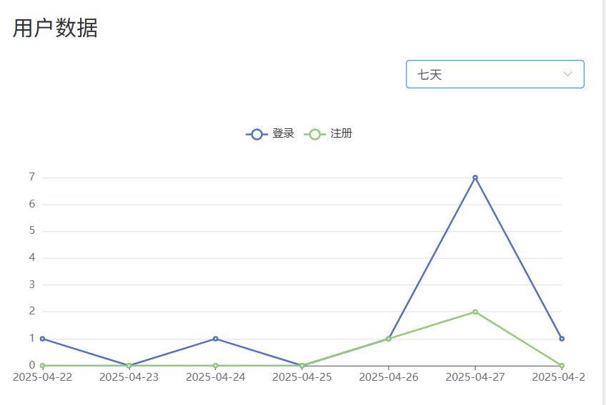

# 用户表单模块
## 需求分析
返回指定天数内的用户数据（包括登录次数和注册次数），这里的指定天数只能是**7、30、90、180和365**  
如图所示：  

## 技术方案
### 前端所传参数
前端只需要传入一个数字，代表指定的天数即可
```json
{
  "Date": "90"
}
```
### 后端存储结构
后端需要使用一个请求结构体存储这个字段  
```go
package request
type UserChart struct {
	Date int `json:"date" form:"date" binding:"required,oneof=7 30 90 180 365"`
}
```
### 实现细节
date字段在https请求中以query方式存在；将req传给service层，根据req.Date字段构建查询参数，将login表和register表的数据返回即可
### 响应结构体
返回日期列表、登录列表和注册列表：
```go
package response
type UserChart struct {
	DateList     []string `json:"date_list"`
	LoginDate    []int    `json:"login_date"`
	RegisterDate []int    `json:"register_date"`
}
```